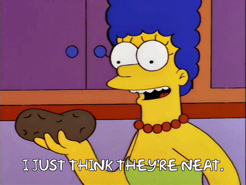
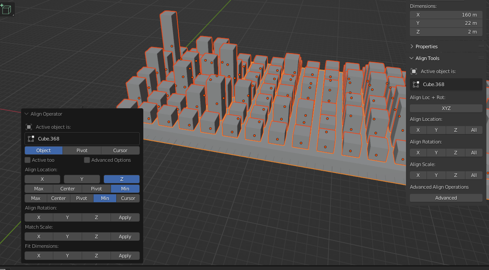

# 🥔 NeatPotato


> I just think they're neat.  
> – Marge Simpson


Imports an SVG file of a Github Contributions graph, and builds it into a custom Blender model that can be 3D printed if you like.

## Setup

To run scripts like this, Blender requires a [specific folder structure](https://docs.blender.org/manual/en/latest/editors/preferences/file_paths.html) to import the script and modules. 

1. Create a folder with the following structure:
	* `scripts`
		- `addons`
		- `modules`
		- `startup`
2. Clone the project to the `modules` folder.
3. In Blender Preferences (`Edit > Preferences`) choose `File Paths` and set the `Scripts` path to the `scripts` folder above. You may need to restart Blender after making these changes.
4. Open a Scripting tab and enter the following:

```
import bpy
import importlib
import NeatPotato.potato

# This line will reload the module for each run, allowing you to work on the file in another editor.
importlib.reload(NeatPotato.potato)

# The path to the SVG file being parsed.
filePath = "/Users/josh/Projects/scripts/modules/NeatPotato/testSvg/graph1.svg"

# Init the module.
potato = NeatPotato.potato.NeatPotato(bpy.context, filePath)
```

The `testbed.blend` file is already setup with the sample code above, but you still need to verify that your Scripts path is configured correctly.

## Debugging

When running scripts like this, Blender won't output messages from things like `print()` statements in the script. To view these, you'll need to launch Blender from the command-line, and view the script output there. On macOS you can use the command:

`/Applications/Blender.app/Contents/MacOS/Blender`

Just leave the Terminal window open while you work, and you'll be able to see the output from the script. I've found it helpful to add the following alias to my `~/.zshrc` file:

```
# Launches Blender from the command-line for script development
alias blender="/Applications/Blender.app/Contents/MacOS/Blender"
```

## Aligning Objects

This script currently will only build the towers of the graph, but does not align them properly. This still needs to be done manually. Once the script has run and the towers are built:

1. Select all objects to be aligned.
2. Use the `Advanced Align Operations` to align all objects to the Z-axis Min. See screenshot below.



---

[](https://www.youtube.com/watch?v=DrQqajtiRt4)

🥔